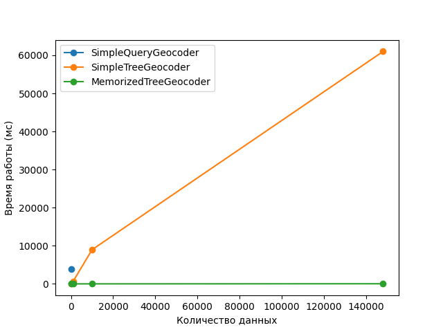
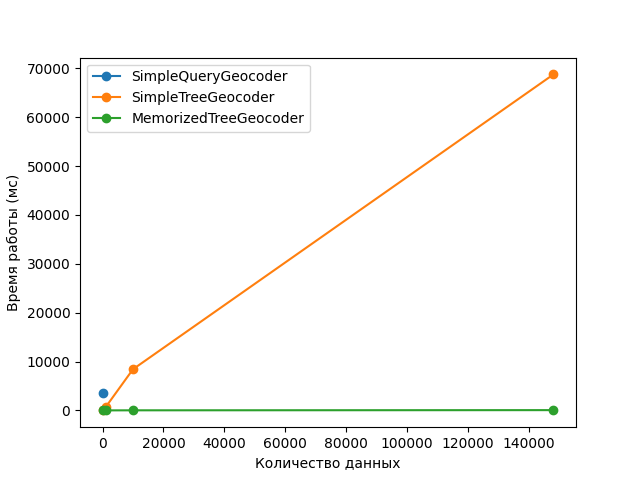
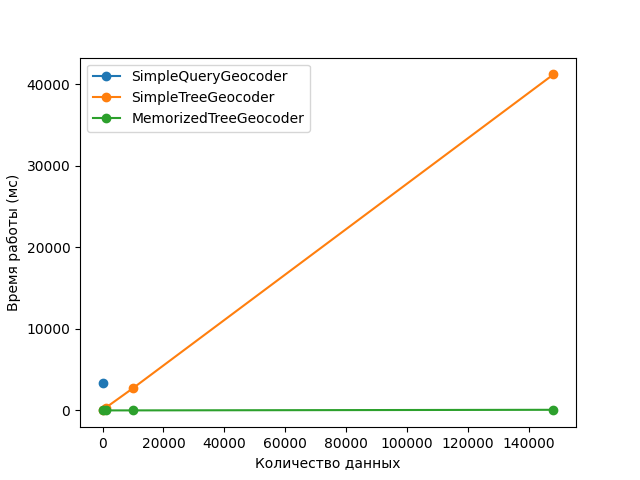
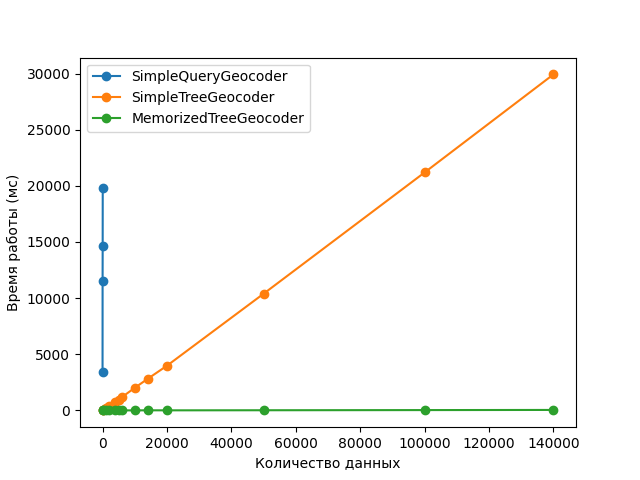
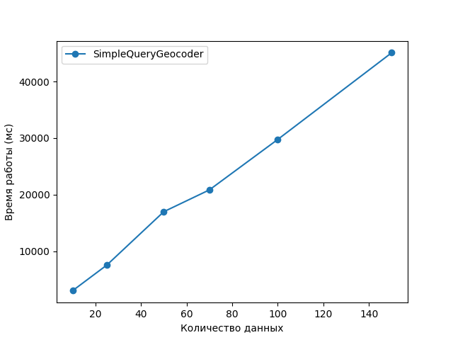

# Отчет о производительности алгоритмов

### Полученные данные о производительности алгоритмов:
#### Примечание: при построении графиков была допущена ошибка, файл sample_data содержит 148000 id, а не указанные 14000
#### 1 запуск
| #  | Алгоритм              | Количество данных | Время работы (мс) |
|----|-----------------------|-------------------|-------------------|
| 0  | SimpleQueryGeocoder   | 10                | 7500.00           |
| 1  | SimpleTreeGeocoder    | 10                | 4.30              |
| 2  | SimpleTreeGeocoder    | 1000              | 208.56            |
| 3  | SimpleTreeGeocoder    | 10000             | 2150.00           |
| 4  | SimpleTreeGeocoder    | 14000             | 32520.00          |
| 5  | MemorizedTreeGeocoder | 10                | 4.00              |
| 6  | MemorizedTreeGeocoder | 1000              | 2.99              |
| 7  | MemorizedTreeGeocoder | 10000             | 6.56              |
| 8  | MemorizedTreeGeocoder | 148000            | 52.45             |

#### 2 запуск
| #  | Алгоритм              | Количество данных | Время работы (мс) |
|----|-----------------------|-------------------|-------------------|
| 0  | SimpleQueryGeocoder   | 10                | 6350.00           |
| 1  | SimpleTreeGeocoder    | 10                | 4.97              |
| 2  | SimpleTreeGeocoder    | 1000              | 184.62            |
| 3  | SimpleTreeGeocoder    | 10000             | 2040.00           |
| 4  | SimpleTreeGeocoder    | 14000             | 34220.00          |
| 5  | MemorizedTreeGeocoder | 10                | 3.26              |
| 6  | MemorizedTreeGeocoder | 1000              | 5.00              |
| 7  | MemorizedTreeGeocoder | 10000             | 5.58              |
| 8  | MemorizedTreeGeocoder | 148000            | 52.33             |

#### 3 запуск
| #  | Алгоритм              | Количество данных | Время работы (мс) |
|----|-----------------------|-------------------|-------------------|
| 0  | SimpleQueryGeocoder   | 10                | 7520.00           |
| 1  | SimpleTreeGeocoder    | 10                | 6.78              |
| 2  | SimpleTreeGeocoder    | 1000              | 204.05            |
| 3  | SimpleTreeGeocoder    | 10000             | 2230.00           |
| 4  | SimpleTreeGeocoder    | 14000             | 32630.00          |
| 5  | MemorizedTreeGeocoder | 10                | 2.99              |
| 6  | MemorizedTreeGeocoder | 1000              | 4.59              |
| 7  | MemorizedTreeGeocoder | 10000             | 5.80              |
| 8  | MemorizedTreeGeocoder | 148000            | 41.74             |

#### 4 запуск. Увеличенная выборка
| #   | Алгоритм              | Количество данных | Время работы (мс) |
|-----|-----------------------|-------------------|-------------------|
| 0   | SimpleQueryGeocoder   | 10                | 6140.00           |
| 1   | SimpleQueryGeocoder   | 25                | 18550.00          |
| 2   | SimpleQueryGeocoder   | 50                | 38020.00          |
| 3   | SimpleQueryGeocoder   | 70                | 51920.00          |
| 4   | SimpleTreeGeocoder    | 10                | 5.07              |
| 5   | SimpleTreeGeocoder    | 100               | 19.22             |
| 6   | SimpleTreeGeocoder    | 1000              | 196.26            |
| 7   | SimpleTreeGeocoder    | 2000              | 386.43            |
| 8   | SimpleTreeGeocoder    | 4000              | 782.52            |
| 9   | SimpleTreeGeocoder    | 5000              | 958.26            |
| 10  | SimpleTreeGeocoder    | 6000              | 1170.00           |
| 11  | SimpleTreeGeocoder    | 10000             | 2360.00           |
| 12  | SimpleTreeGeocoder    | 14000             | 4000.00           |
| 13  | SimpleTreeGeocoder    | 20000             | 4070.00           |
| 14  | SimpleTreeGeocoder    | 50000             | 12720.00          |
| 15  | SimpleTreeGeocoder    | 100000            | 23130.00          |
| 16  | SimpleTreeGeocoder    | 140000            | 32890.00          |
| 17  | MemorizedTreeGeocoder | 10                | 9.85              |
| 18  | MemorizedTreeGeocoder | 100               | 6.73              |
| 19  | MemorizedTreeGeocoder | 1000              | 5.72              |
| 20  | MemorizedTreeGeocoder | 2000              | 4.51              |
| 21  | MemorizedTreeGeocoder | 4000              | 4.89              |
| 22  | MemorizedTreeGeocoder | 5000              | 5.90              |
| 23  | MemorizedTreeGeocoder | 6000              | 4.85              |
| 24  | MemorizedTreeGeocoder | 10000             | 7.43              |
| 25  | MemorizedTreeGeocoder | 14000             | 6.81              |
| 26  | MemorizedTreeGeocoder | 20000             | 8.78              |
| 27  | MemorizedTreeGeocoder | 50000             | 17.26             |
| 28  | MemorizedTreeGeocoder | 100000            | 31.58             |
| 29  | MemorizedTreeGeocoder | 140000            | 52.51             |

#### 5 запуск. Только SimpleQueryGeocoder
| #  | Алгоритм             | Количество данных | Время работы (мс) |
|----|----------------------|-------------------|-------------------|
| 0  | SimpleQueryGeocoder  | 10                | 6560.0            |
| 1  | SimpleQueryGeocoder  | 25                | 18240.0           |
| 2  | SimpleQueryGeocoder  | 50                | 36480.0           |
| 3  | SimpleQueryGeocoder  | 70                | 55680.0           |
| 4  | SimpleQueryGeocoder  | 100               | 71510.0           |
| 5  | SimpleQueryGeocoder  | 150               | 111940.0          |

### Анализ полученных данных

#### 1. Самым медленным из алгоритмов является алгоритм "в лоб" (SimpleQueryGeocoder)
Причина низкой производительности связана с использованием API hh.ru для получения каждой из вершин, составляющих искомую ветвь дерева(адрес).
Обращение к сетевым источникам данных всегда в разы медленнее, чем к внутренней памяти компьютера, так как, во-первых, полученные данные 
в любом случае должны быть загружены в ОЗУ перед началом работы, а во-вторых, данным, полученным через интернет, приходиться преодолеть несравнимо 
больший и комплексный путь по компьютерным сетям, чем тем, что хранятся в ОЗУ компьютера.

Таким образом, большую часть времени программе приходиться простаивать в ожидании следующей вершину, тогда как SimpleTreeGeocoder и MemorizedTreeGeocoder почти сразу 
переходят к ней.

#### 2. SimpleTreeGeocoder показал среднюю производительность (алгоритм Перебора дерева)

В отличие от SimpleQueryGeocoder, SimpleTreeGeocoder'у не требуется простаивать в ожидании данных - все древо адресов сразу загружается в память компьютера.
Однако для геокодирования id SimpleTreeGeocoder каждый раз "в лоб" перебирает всё дерево в поисках нужной вершины: для каждого id он начинает перебирать дерево с корня, много раз проходя одни и те же вершины.

Таким образом, алгоритм тратит много процессорного времени на повторный перебор всего дерева, что негативно сказывается на производительности

#### 3. Самым быстрым алгоритмом оказался MemorizedTreeGeocoder (алгоритм Мемоизации дерева)

Учитывая недостатки SimpleQueryGeocoder и SimpleTreeGeocoder, MemorizedTreeGeocoder показывает лучшую производительность:
- Во-первых, алгоритм не тратит время на ожидание вершин от API, так как все дерево сразу загружается в память.
- Во-вторых, алгоритм, собирая при переборе дерева для всех вершин полный адрес и запоминая его с помощью словаря, избавляется от необходимости повторного перебора дерева: 
достаточно один раз пройти все дерево, чтобы иметь доступ к адресу любой из вершин. При этом временная сложность доступа значения по ключу для словаря составляет O(1), что обеспечивает почти мгновенный доступ к любой вершине.

Таким образом, алгоритм добивается максимальной оптимизации использования процессорного времени. (но требует выделения дополнительной памяти под словарь)

### 4. Анализ графиков
Представленные выше графики наглядно демонстрируют разницу в производительности алгоритмов:
- график MemoryTreeGeocoder - почти плоский, параллельный оси Ox, аппроксимируя его, можно сказать что скорость работы алгоритма - константная 
- график SimpleTreeGeocoder - постепенно растет по мере увеличения количества id, скорость работы алгоритма ~ линейная
- график SimpleQueryGeocoder - возрастает намного быстрее, чем график SimpleQueryTreeGeocoder, скорость работы алгоритма ~ полиномиальная

### Итог

Анализ приведенных алгоритмов демонстрирует важность выбора наиболее эффективного алгоритма в контексте решаемой задачи. Хоть наивный алгоритм легко запрограммировать, но для большинства задач он не применим: чтобы геокодировать даже 1000 id нам потребуются сутки! 
С другой стороны, MemorizedTreeGeocoder геокодирует сотни тысяч id за несколько миллисекунд, однако ему требуется сравнительно много дополнительной памяти для работы. А что если мы ограничены в памяти? Тогда мы можем использовать SimpleTreeGeocoder в качестве компромиссного варианта или 
SimpleQueryGeocoder, если мы собираемся геокодировать небольшие объемы данных. 

Это приводит нас к необходимости уметь оценивать сложность работы алгоритма (временную и пространственную), но так как каждый раз опытным путем анализировать производительность алгоритма - неудобно и не всегда возможно, то для описания сложности алгоритмов предпочтительным вариантом является использование big O notation (асимптотическая оценка).